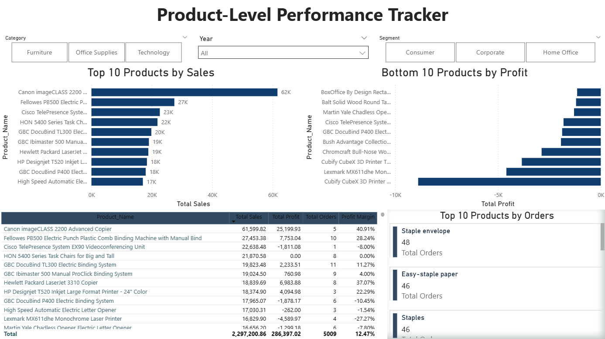

# Retail Sales Performance Analysis – Power BI Project
A data-driven retail analysis project uncovering sales, profit, and discount insights using Power BI.

## Overview
This project analyzes retail sales, profit trends, and regional performance using Excel and Power BI.  
It provides actionable insights to improve profitability, discount strategy, and product mix.

## Tools Used
- Microsoft Excel – Data Cleaning & Preparation  
- Microsoft Power BI – Data Modeling, KPI Cards, and Interactive Dashboards  

## Key Insights
- **West Region** leads in both sales & profit.  
- **Central Region** records a net loss of ₹56K.  
- **Consumer Segment** contributes ~45% of total sales.  
- **Canon imageCLASS 2200** tops in sales performance.  
- **Furniture** has 111%+ average discount, reducing profit margin.

## Dashboards
| Dataset Overview | Time Trends | Regional Trends |
|-------------------|--------------------|-----------------|
|  |  |  |

| Product Performance | Losses & Risks | Executive Summary |
|-------------------|--------------------|-----------------|
|  |  |  |

## Results
- Created an end-to-end BI solution to monitor business health.
- Delivered insights that could improve profitability by optimizing discount policies.

## Dataset
Dataset: **Sample Superstore** (Kaggle / Power BI sample dataset)  
Cleaned & transformed in Excel for Power BI modeling.

## Author
**Hiranmayi Mula**  
[hiranmayimula@gmail.com]
